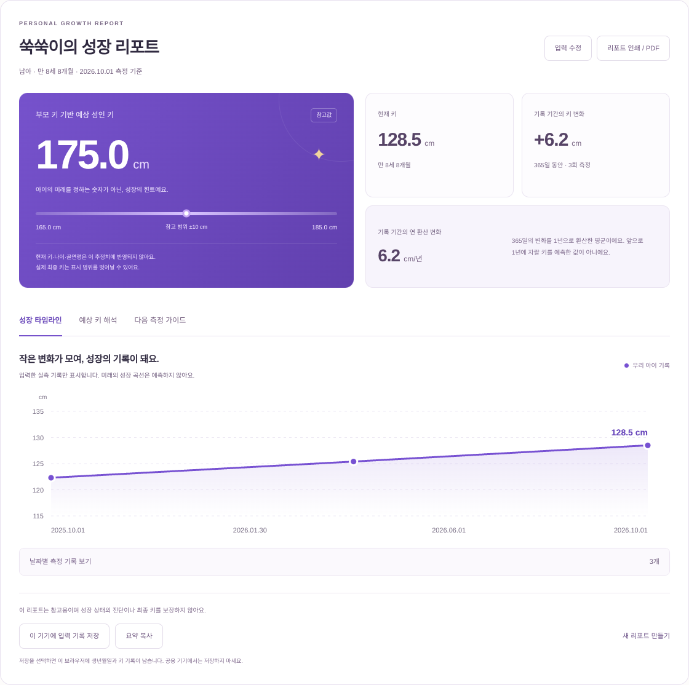

# 키즈텐 · 우리 아이 성장 리포트 v2

부모 키 기반 예상 성인 키와 아이의 실제 측정 기록을 함께 보는 반응형 웹앱입니다. 기존 PHP 홈페이지에 배포된 상태는 아닙니다.

## 바로 확인하기

- [성장 리포트 완성 화면](preview/desktop.png)
- [모바일 리포트](preview/mobile.png)
- [3단계 입력 화면](preview/input.png)
- [단일 실행 파일](standalone.html): GitHub 파일 페이지의 **Download raw file**로 내려받아 브라우저에서 열어 주세요. GitHub 소스 화면에서는 앱이 실행되지 않습니다.

**샘플 리포트 먼저 보기**를 누르면 실제 기능을 바로 확인할 수 있습니다.



## 달라진 기능

- 3단계 입력: 아이 정보 → 부모 키 → 이전 측정 기록(선택)
- 측정일 기준 만 나이와 현재 키, 부모 키 기반 예상 성인 키
- 최대 5개 이전 기록과 현재 기록을 날짜순으로 연결하는 실측 차트 및 표
- 실제 경과 일수에 따른 키 변화량과 기록 기간의 연 환산 변화
- 기록이 없거나, 간격이 짧거나, 키가 줄어든 경우 각각 다른 안내
- 계산식과 반영된 정보를 설명하는 결과 탭, 키보드로 조작 가능한 탭
- 리포트 인쇄 / PDF 저장, 요약 복사
- 명시적으로 선택하는 브라우저 저장·불러오기·삭제
- 다음 키 측정을 위한 캘린더 파일(.ics) 다운로드
- 좁은 화면용 입력 및 리포트 레이아웃, 인쇄 전용 스타일

## 실행과 테스트

별도 앱 패키지 설치 없이 `standalone.html`을 브라우저에서 열 수 있습니다. 개발 서버는 저장소 루트에서 실행합니다.

```sh
npm start
# 또는 python3 -m http.server 3000 --bind 0.0.0.0
```

Node.js 내장 테스트로 계산과 입력 정책을 검증합니다.

```sh
npm test
```

독립 HTML은 원본 소스를 편집한 뒤 다시 생성합니다.

```sh
npm run build:standalone
```

선택적인 Linux 브라우저 테스트는 앱과 별도로 도구를 설치합니다. 서버가 실행 중이어야 합니다.

```sh
npm install --prefix /tmp/kids10-test-tools playwright-core @sparticuz/chromium axe-core
NODE_PATH=/tmp/kids10-test-tools/node_modules npm run test:browser
```

브라우저 테스트는 3단계 입력, 오류, 성별 전환, 차트, 기록 없는 결과, 탭 키보드 조작, ICS 내용, 인쇄/PDF, 복사, 저장·삭제, 손상된 저장 데이터, 7개 화면 너비, 접근성 자동 점검을 포함합니다. 접근성 자동 검사가 전체 수동 접근성 검증을 대신하지는 않습니다.

## 계산과 표시 정책

- 예상 성인 키: 남아 `(아빠 키 + 엄마 키 + 13) / 2`, 여아 `(아빠 키 + 엄마 키 - 13) / 2`. 표시값은 소수점 첫째 자리, 참고 범위는 ±10 cm입니다.
- **아이의 현재 키·나이·측정 기록으로 예상 성인 키를 보정하지 않습니다.** 골연령, 사춘기 정보 등을 반영하는 임상 예측 모델이 아닙니다.
- 만 나이는 생년월일과 현재 키 측정일로 계산합니다. 입력 대상은 측정일 기준 만 2~18세입니다.
- 이전 기록은 출생일 이후, 현재 측정일 이전이어야 하며 중복 날짜는 받지 않습니다.
- 키 변화는 마지막 측정값에서 첫 측정값을 뺍니다. 연 환산 변화는 `키 변화 / 실제 경과 일수 × 365.25`입니다. 관찰한 기록 기간의 평균이며 미래 성장량 예측이 아닙니다.
- 표시 정책상 90일 미만 기록 또는 일부 측정값이 감소한 기록은 연 환산하지 않습니다. 90일은 임상적 정상·비정상 판정 기준이 아닙니다.
- 또래 백분위, 성장 상태 진단, 미래 성장 곡선을 임의로 생성하지 않습니다.
- 다음 측정일은 마지막 측정일 +90일입니다. 이미 지난 날짜이면 오늘 다음 날을 제안합니다. 의료진의 일정이 있다면 우선하도록 안내합니다.
- 아이 키 50~230 cm, 부모 키 100~230 cm, 소수점 첫째 자리까지는 앱의 입력 범위이며 정상 범위를 뜻하지 않습니다.

공식 출처: [AAFP, Evaluation of Short and Tall Stature in Children (2015)](https://www.aafp.org/pubs/afp/issues/2015/0701/p43.html).

## 개인정보와 기기 저장

입력값을 서버로 전송하거나 자동 저장하지 않습니다. **이 기기에 입력 기록 저장**을 누른 경우에만 별명, 생년월일, 부모 키, 아이 측정 기록이 해당 브라우저의 `localStorage`에 저장됩니다. 저장 전 설명을 표시하며, 공용 기기에서 저장하지 않도록 안내합니다. 저장 데이터는 암호화되지 않으며 해당 기기·브라우저에 접근할 수 있는 사람이 볼 수 있습니다. 상단 저장 기록 메뉴에서 불러오거나 삭제할 수 있습니다. 브라우저가 저장을 차단한 경우 오류를 안내합니다.

`file://`로 연 독립 파일에서 클립보드나 기기 저장 지원은 브라우저에 따라 다릅니다. 지원되지 않으면 화면에 안내하며 리포트 인쇄/PDF를 사용할 수 있습니다. PDF 저장은 브라우저 인쇄 창에서 선택합니다. 캘린더 파일은 사용자가 캘린더 앱에서 직접 가져옵니다.

외부 요청은 Google Fonts 글꼴이며, 연결이 불가능하면 시스템 글꼴을 사용합니다. 글꼴 요청에 입력값을 포함하지 않습니다.

## 파일과 홈페이지 적용

- `index.html`: 입력 단계와 성장 리포트, 가이드
- `styles.css`, `report.css`: 공통 디자인과 입력·리포트·인쇄 스타일
- `calculator.js`: 날짜, 나이, 입력 검증, 키 계산과 기록 분석
- `app.js`: 입력 흐름, 차트, 저장·복사·캘린더
- `scripts/build_standalone.py`: 단일 HTML 생성
- `tests/`: 계산 회귀 테스트 및 선택적 브라우저 검증

기존 PHP 소스나 배포 설정은 이 저장소에 없습니다. 별도 경로에 이 앱을 배포한 후 기존 예상 키 탭에서 연결하거나, 기존 레이아웃으로 이식하면서 CSS 선택자 범위를 한정해 통합할 수 있습니다. 실제 서비스에 반영하기 전 운영 계산 정책, 개인정보 정책 및 브랜드 자산을 확인하세요.
